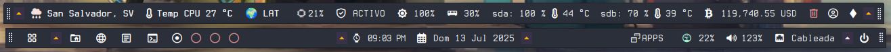

# 🐾 XFCE Genmon Plugin Suite for Puppy Linux

📗 [Versión en español](README.md)

A modular collection of scripts designed for the Genmon plugin in XFCE, allowing you to 
build **fully functional panels exclusively with scripts**, without the need for additional applets. 
This suite is optimized for Puppy Linux and integrates directly into its filesystem.

🔗 **Official Genmon plugin reference:**  
[docs.xfce.org → xfce4-genmon-plugin](https://docs.xfce.org/panel-plugins/xfce4-genmon-plugin/start)



---

## 🧩 What does this suite include?

- 🖥️ Complete panels with:
  - Main menu  
  - Application launchers  
  - Virtual desktops  
  - Open windows  
- 📊 Monitors:
  - CPU, RAM, network, volume  
  - Current weather status  
  - Real-time Bitcoin price  
- ⚙️ Configuration tools:
  - Enable/disable scripts  
  - Conditional hiding  
  - Visual customization  

---

## 📂 System structure

The suite is organized to integrate directly into Puppy Linux's filesystem:

```bash
XFCE-Genmon-Plugin-Suite-for-PuppyLinux/
├── root/
│   └── .config/
│       ├── genmon-scripts/
│       │   └── simple/
│       │       ├── cpu.sh
│       │       ├── weather.sh
│       │       ├── btc.sh
│       │       └── ... (more scripts)
│       └── genmon-hide/
│           ├── .toggle_state
│           ├── .toggle_state_weather
│           ├── fusilli
│           └── ... (hide control files)
├── usr/
│   ├── bin/
│   │   └── skippy-xd
│   └── local/
│       └── bin/
│           ├── panel-config.py
│           ├── shutdown-gui
│           └── battery-notifier.sh
```
## ⚙️ Technical details
## 🌐 Automatic localization

Scripts detect the system language using the $LANG environment variable and dynamically 
adapt displayed text:
```bash
LANG_CODE=$(echo "$LANG" | cut -d '_' -f1 | tr '[:upper:]' '[:lower:]')

set_tooltip_text() {
    case "$1" in
        es) TOOLTIP_TEXT="Haz clic para abrir\nla terminal";;
        *)  TOOLTIP_TEXT="Click to open\nthe terminal";;
    esac
}
set_tooltip_text "$LANG_CODE"
```
---
## 🙈 Conditional hiding (file-based)

Each module can be hidden if a specific file exists in ~/.config/genmon-hide/. For example, 
to hide the terminal icon:
```bash
HIDE_FILE_TERMINAL="$HOME/.config/genmon-hide/terminal"

if [ -f "$HIDE_FILE_TERMINAL" ]; then
    echo -e "<txt></txt>\n<tool></tool>"
    exit 0
fi
```
---
Simply create or delete the file ~/.config/genmon-hide/terminal to hide or 
show the module—no panel restart required

## 💡 Notes

    ✅ Fully compatible with XFCE on Puppy Linux distributions

    🔒 No root privileges required for most functions

    🧩 Modular: easily enable or disable any component
---   
## 🛠️ XFCE Panel Configuration with Genmon

This Python script (/usr/local/bin/panel-config.py) provides a graphical interface to manage XFCE panel modules that
use the Genmon plugin. It allows you to visually enable or disable components 
like brightness, CPU temperature, RAM, battery, network connection, favorite apps, 
launchers, and more.
### ✨ Features

   -  **GTK3**-based graphical interface
   -   Multilingual support: Spanish and English
   -   Organized into tabs:
   -   System
   -   Network & Security        
   -   Applications
   -   Launchers
   -   Panel

Toggles modules by creating/removing files in ~/.config/genmon-hide
Automatically detects Genmon IDs from XFCE panel configuration (~/.config/xfce4/panel)


---
## 🪟 Open Windows Viewer

This Bash script (open-windows.sh) located in /root/.config/genmon-scripts/ dynamically
 displays open windows on the current desktop or visible region (Fusilli window manager). 
 It uses custom icons to represent each open application and launches a visual 
 window selector (skippy-xd) on click.
### ✨ Features

  -  Auto-detects system language ($LANG) for localized tooltips
  -  Supports multiple window managers: XFCE and Fusilli
  -  Displays icons per application using Nerd Font
  -  Detects multiple instances of the same app
  -  Special indicator if the trash is full
  -  Tooltip with app list and instance count
  -  Click action: runs skippy-xd-wrapper to switch windows

### 🧩 Dependencies

   - wmctrl
   - xrandr
   - Bash ≥ 3.2
   - Recommended font: Terminess Nerd Font
   - skippy-xd    

### 🖼️ Example output on the panel
```bash
<txt>󰖟  󰧭    </txt>
<tool>
 Switch windows
├─ 󰖟 Firefox (1)
├─  Thunar (2)
└─  Terminal (1)
</tool>
```
## 🧭 What is Skippy-XD?

Skippy-XD is a full-screen task switcher for X11 systems, inspired by macOS's Exposé effect. 
When activated, it shows live thumbnails of all open windows on the current desktop, allowing 
fast switching via mouse or keyboard.
### ✨ Key features

   - Live, updated view of all open windows
   - Compatible with lightweight environments like XFCE, LXDE, Openbox
   - Lightweight, fast, and highly configurable
   - Can be triggered via tools like Brightside using active screen corners
--- 
## 🎛️ Toggles ("Tirantes")

This script acts as a visual toggle in the XFCE panel: when clicked, it hides or shows multiple Genmon modules at once, simulating a dropdown effect. Perfect for keeping the panel clean and showing only essential elements when needed.
### ✨ Features

  -  Toggles multiple modules (storage, volume, batt, usb, connection) with a single click
  -  Uses visual icons (, ) to indicate visibility state
  -  Stores current state in ~/.config/genmon-hide/.toggle_state
  -  Multilingual tooltip support
  -  Genmon-compatible output: <txt>, <tool>, <txtclick>

### ⚙️ Technical detail

The script works by creating or deleting empty files in ~/.config/genmon-hide/. 
Each Genmon module checks for its corresponding file to decide whether to show or hide. 
When run with the toggle parameter, it switches the global state (visible ↔ hidden) 
and updates all control files.

    📌 Ideal for dynamic panels where modules “drop down” when interacting with the toggle. 
```bash
# Read toggle status
if [ -f "$TOGGLE_STATE_FILE" ]; then 
TOGGLE_STATE=$(cat "$TOGGLE_STATE_FILE")
else 
TOGGLE_STATE="hidden"
fi

# Toggle general status
if [[ "$1" == "toggle" ]]; then 
if [[ "$TOGGLE_STATE" == "hidden" ]]; then 
TOGGLE_STATE="visible" 
for FILE in "${FILES[@]}"; do 
FILE_PATH="$HOME/.config/genmon-hide/$FILE" 
if [ -f "$FILE_PATH" ]; then 
rm "$FILE_PATH" 
fi 
donated 
else 
TOGGLE_STATE="hidden" 
for FILE in "${FILES[@]}"; do
FILE_PATH="$HOME/.config/genmon-hide/$FILE"
if [ ! -f "$FILE_PATH" ]; then
touch "$FILE_PATH"
fi
done
fi
echo "$TOGGLE_STATE" > "$TOGGLE_STATE_FILE"
fi
```


---
## 🛠️ Custom Layouts with Genmon: Unlimited Creativity!

Genmon isn't just for displaying text in the XFCE panel: it also lets you
create highly customized visual widgets using ASCII code, decorative segments, and
Pango tags to apply styles like colors, fonts, sizes, and more.

### 🎨 What can you do?

With Genmon, you can build widgets similar to Conky's, but with additional benefits such as:

- <txtclick>: Execute commands on click.
- <tool>: Display additional information on hover (tooltip).
- Pango Styles: Use tags like <span> to change colors, fonts, sizes, weight, etc.
- ASCII Decoration: Add borders, boxes, lines, and symbols for visual style.
- Dynamic Segments: Display information that changes in real time (battery status, trash, network, etc.).

### 📦 Example: Trash Widget

This script displays the status of the trash (empty or full) with an icon, dynamic colors, decorative borders, and interactive actions:
```bash
#!/usr/bin/env bash

# Icon and colors
ICON_TRASH="󰩺"
COLOR_EMPTY="#2ECC71"
COLOR_FULL="#95A5A6"
TRASH_PATH="$HOME/.local/share/Trash/files"

# Check if there are files in the trash
if [[ -d "$TRASH_PATH" && "$(ls -A "$TRASH_PATH")" ]]; then 
TRASH_STATUS="Full" 
COLOR="$COLOR_FULL"
else 
TRASH_STATUS="Empty" 
COLOR="$COLOR_EMPTY"
fi

# Main line with color and icon
DISPLAY_LINE="<span foreground='$COLOR'>$ICON_TRASH Trash</span>"

# Decorative borders
WIDTH=${#DISPLAY_LINE}
TOP="╭──────╮"
MID="<span foreground='#35C5B9'>│ $DISPLAY_LINE │</span>"
BOTTOM="╰──────╯"

# Output for Genmon
echo -e "<txt><span foreground='#ADD387'>$TOP</span>\n$MID\n<span foreground='#ADD387'>$BOTTOM</span></txt>"
echo -e "<tool><span font_family='Terminess Nerd Font' font_size='16000' weight='bold'>Trash status: $TRASH_STATUS\nClick to open the trash folder.</span></tool>"
echo -e "<txtclick>exo-open --launch FileManager trash:///</txtclick>"
```
Result:


## 🛠️ What can you customize? 

- Visual design with borders, icons, and colors.
- Typographic styling with <span> tags using Pango.
- Direct interaction with clicks and tooltips.
- Conky-like widgets, but integrated into the XFCE panel.
---


---
