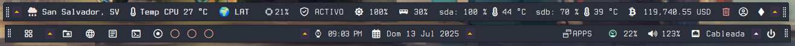

# 🐾 XFCE Genmon Plugin Suite para Puppy Linux

📘 [English version](README-EN.md)

Una colección modular de scripts diseñados para el plugin Genmon en XFCE, que permite construir **paneles completos exclusivamente con scripts**, sin necesidad de applets adicionales. Esta suite está optimizada para Puppy Linux y se integra directamente en su sistema de archivos.

🔗 **Referencia oficial del plugin Genmon:**  
[docs.xfce.org → xfce4-genmon-plugin](https://docs.xfce.org/panel-plugins/xfce4-genmon-plugin/start)



---

## 🧩 ¿Qué incluye esta suite?

- 🖥️ Paneles completos con:
  - Menú principal  
  - Lanzadores de aplicaciones  
  - Escritorios virtuales  
  - Ventanas abiertas  
- 📊 Monitores:
  - CPU, RAM, red, volumen  
  - Estado del clima actual  
  - Precio de Bitcoin en tiempo real  
- ⚙️ Herramientas de configuración:
  - Activación/desactivación de scripts  
  - Ocultación condicional  
  - Personalización visual  

---

## 📂 Estructura del sistema

La suite está organizada para integrarse directamente en el sistema de archivos de Puppy Linux:

```bash
XFCE-Genmon-Plugin-Suite-para-PuppyLinux/
├── root/
│   └── .config/
│       ├── genmon-scripts/
│       │   └── simple/
│       │       ├── cpu.sh
│       │       ├── weather.sh
│       │       ├── btc.sh
│       │       └── ... (más scripts)
│       └── genmon-hide/
│           ├── .toggle_state
│           ├── .toggle_state_weather
│           ├── fusilli
│           └── ... (archivos de ocultación)
├── usr/
│   ├── bin/
│   │   └── skippy-xd
│   └── local/
│       └── bin/
│           ├── panel-config.py
│           ├── shutdown-gui
│           └── notificador-bateria.sh
```
---

## ⚙️ Detalles técnicos

### 🌐 Localización automática

Los scripts detectan el idioma del sistema mediante la variable de entorno `$LANG`, 
y adaptan dinámicamente el texto mostrado:

```bash
LANG_CODE=$(echo "$LANG" | cut -d '_' -f1 | tr '[:upper:]' '[:lower:]')

set_tooltip_text() {
    case "$1" in
        es) TOOLTIP_TEXT="Haz clic para abrir\nla terminal";;
        *)  TOOLTIP_TEXT="Click to open\nthe terminal";;
    esac
}
set_tooltip_text "$LANG_CODE"
 === 🧾 Tooltip ===
MORE_INFO="<tool>"
MORE_INFO+="<span font_family='$FONT_MAIN' font_size='$TOOLTIP_FONT_SIZE' weight='$TOOLTIP_WEIGHT' foreground='$COLOR_ACCENT'>"
MORE_INFO+="$TOOLTIP_TEXT"
MORE_INFO+="</span>"
MORE_INFO+="</tool>"

```
---

## 🙈 Ocultación condicional (basada en archivo)

Cada módulo puede ocultarse si existe un archivo específico en ~/.config/genmon-hide/. 
Por ejemplo, para ocultar el icono del terminal:


```bash

HIDE_FILE_TERMINAL="$HOME/.config/genmon-hide/terminal"

if [ -f "$HIDE_FILE_TERMINAL" ]; then
    echo -e "<txt></txt>\n<tool></tool>"
    exit 0
fi
```
---

De este modo, basta con crear (o eliminar) el archivo ~/config/genmon-hide/terminal para que el 
módulo se oculte o reaparezca, sin reiniciar el panel.
## 💡 Notas

    Totalmente compatible con XFCE en distribuciones Puppy Linux.

    No requiere privilegios root para la mayoría de funciones.

    Modular: puedes activar o desactivar cualquier componente fácilmente.
---
## 🛠️ Configuración del Panel XFCE con Genmon

Este script en Python (/usr/local/bin/panel-config.py proporciona una interfaz gráfica para gestionar los módulos del panel
 XFCE que utilizan el plugin Genmon. Permite activar o desactivar visualmente componentes como 
 brillo, temperatura de CPU, RAM, batería, conexión de red, aplicaciones favoritas, lanzadores y más.

### ✨ Características

- Interfaz gráfica basada en **GTK3**
- Soporte multilingüe: **Español** e **Inglés**
- Organización por pestañas:
  - **Sistema**
  - **Red y Seguridad**
  - **Aplicaciones**
  - **Lanzadores**
  - **Panel**
- Conmutadores para ocultar o mostrar módulos mediante archivos en `~/.config/genmon-hide`
- Detección automática del ID de Genmon en la configuración del panel XFCE (`~/.config/xfce4/panel`)


---

## 🪟 Visualizador de Ventanas Abiertas

Este script en Bash en /root/.config/genmon-scripts/open-windows.sh muestra dinámicamente las ventanas abiertas en el 
escritorio actual o en la región visible del gestor de ventanas Fusilli. 
Utiliza íconos personalizados para representar cada aplicación abierta y 
permite lanzar un selector visual de ventanas (`skippy-xd`) al hacer clic.

### ✨ Características

- Detección automática del idioma del sistema (`$LANG`) para mostrar etiquetas en español o inglés.
- Soporte para múltiples gestores de ventanas: XFCE estándar o Fusilli.
- Visualización de íconos por aplicación usando fuentes Nerd Font.
- Detección de múltiples instancias de una misma aplicación.
- Indicador especial para la papelera si está llena.
- Tooltip detallado con lista de aplicaciones abiertas y cantidad de instancias.
- Acción al hacer clic: ejecuta `skippy-xd-wrapper` para cambiar de ventana.

### 🧩 Dependencias

- `wmctrl`  
- `xrandr`  
- Bash ≥ 3.2  
- Fuente recomendada: **Terminess Nerd Font**
- skippy-xd

### 🖼️ Ejemplo de salida en el panel

```xml
<txt>󰖟  󰧭    </txt>
<tool>
 Cambiar ventanas
├─ 󰖟 Firefox (1)
├─  Thunar (2)
└─  Terminal (1)
</tool>
```
---

## 🧭 ¿Qué es Skippy-XD?

**Skippy-XD** es un selector de tareas a pantalla completa para sistemas X11, inspirado en el 
efecto *Exposé* de macOS. Al activarlo, muestra una vista en miniatura de todas las ventanas 
abiertas en el escritorio actual, permitiendo al usuario cambiar rápidamente entre ellas usando 
el mouse o el teclado.

### ✨ Características principales

- Vista en vivo y actualizada de todas las ventanas abiertas.
- Compatible con entornos ligeros como XFCE, LXDE, Openbox.
- Ligero, rápido y altamente configurable.
- Puede integrarse con herramientas como **Brightside** para activarse desde esquinas activas del escritorio.
---

## 🎛️ Tirantes (Toggle de módulos)

Este script actúa como un **tirante** visual en el panel XFCE: al hacer clic, 
oculta o muestra varios módulos Genmon simultáneamente, simulando un efecto de despliegue. 
Es ideal para mantener el panel limpio y mostrar solo los elementos necesarios cuando se desea.

### ✨ Características

- Alterna el estado de múltiples módulos (`storage`, `volume`, `batt`, `usb`, `connection`) con un solo clic.
- Usa íconos visuales (``, ``) para indicar si los módulos están visibles u ocultos.
- Guarda el estado actual en `~/.config/genmon-hide/.toggle_state`.
- Soporte multilingüe: muestra el tooltip en español o inglés según el sistema.
- Compatible con Genmon: salida en formato `<txt>`, `<tool>`, `<txtclick>`.

### ⚙️ Detalle técnico

El script funciona creando o eliminando archivos vacíos en `~/.config/genmon-hide/`.  
Cada módulo Genmon verifica si su archivo correspondiente existe para decidir si debe 
mostrarse u ocultarse. Al ejecutar el script con el parámetro `toggle`, se alterna el 
estado general (`visible` ↔ `hidden`) y se actualizan todos los archivos de control.

> 📌 Ideal para crear paneles dinámicos donde los módulos se “despliegan” al 
interactuar con el tirante.
```bash
# Leer el estado del toggle
if [ -f "$TOGGLE_STATE_FILE" ]; then
    TOGGLE_STATE=$(cat "$TOGGLE_STATE_FILE")
else
    TOGGLE_STATE="hidden"
fi

# Alternar el estado general
if [[ "$1" == "toggle" ]]; then
    if [[ "$TOGGLE_STATE" == "hidden" ]]; then
        TOGGLE_STATE="visible"
        for FILE in "${FILES[@]}"; do
            FILE_PATH="$HOME/.config/genmon-hide/$FILE"
            if [ -f "$FILE_PATH" ]; then
                rm "$FILE_PATH"
            fi
        done
    else
        TOGGLE_STATE="hidden"
        for FILE in "${FILES[@]}"; do
            FILE_PATH="$HOME/.config/genmon-hide/$FILE"
            if [ ! -f "$FILE_PATH" ]; then
                touch "$FILE_PATH"
            fi
        done
    fi
    echo "$TOGGLE_STATE" > "$TOGGLE_STATE_FILE"
fi
```
---


## 🛠️ Diseños Personalizados con Genmon: ¡Creatividad sin límites!

Genmon no solo sirve para mostrar texto en el panel de XFCE: también te permite 
crear widgets visuales altamente personalizados usando código ASCII, segmentos decorativos, y 
etiquetas Pango para aplicar estilos como colores, fuentes, tamaños y más.

### 🎨 ¿Qué puedes hacer?

Con Genmon puedes construir widgets similares a los de Conky, pero con ventajas adicionales como:

  -  <txtclick>: Ejecuta comandos al hacer clic.
  -  <tool>: Muestra información adicional al pasar el cursor (tooltip).
  -  Estilos con Pango: Usa etiquetas como <span> para cambiar colores, fuentes, tamaños, peso, etc.
  -  Decoración con ASCII: Añade bordes, cajas, líneas y símbolos para dar estilo visual.
  -  Segmentos dinámicos: Muestra información que cambia en tiempo real (estado de batería, papelera, 
  -  red, etc.).

### 📦 Ejemplo: Widget de Papelera

Este script muestra el estado de la papelera (vacía o llena) con un ícono, 
colores dinámicos, bordes decorativos y acciones interactivas:
```bash
#!/usr/bin/env bash

# Ícono y colores
ICON_TRASH="󰩺"
COLOR_EMPTY="#2ECC71"
COLOR_FULL="#95A5A6"
TRASH_PATH="$HOME/.local/share/Trash/files"

# Verifica si hay archivos en la papelera
if [[ -d "$TRASH_PATH" && "$(ls -A "$TRASH_PATH")" ]]; then
  TRASH_STATUS="Full"
  COLOR="$COLOR_FULL"
else
  TRASH_STATUS="Empty"
  COLOR="$COLOR_EMPTY"
fi

# Línea principal con color e ícono
DISPLAY_LINE="<span foreground='$COLOR'>$ICON_TRASH Trash</span>"

# Bordes decorativos
WIDTH=${#DISPLAY_LINE}
TOP="╭──────╮"
MID="<span foreground='#35C5B9'>│ $DISPLAY_LINE │</span>"
BOTTOM="╰──────╯"

# Salida para Genmon
echo -e "<txt><span foreground='#ADD387'>$TOP</span>\n$MID\n<span foreground='#ADD387'>$BOTTOM</span></txt>"
echo -e "<tool><span font_family='Terminess Nerd Font' font_size='16000' weight='bold'>Trash status: $TRASH_STATUS\nClick to open the trash folder.</span></tool>"
echo -e "<txtclick>exo-open --launch FileManager trash:///</txtclick>"
```
Resultado: 


## 🛠️ ¿Qué puedes personalizar?

  -  Diseño visual con bordes, íconos y colores.
  -  Estilo tipográfico con etiquetas <span> usando Pango.
  -  Interacción directa con clics y tooltips.
  -  Widgets tipo Conky, pero integrados al panel XFCE.
---   


---
